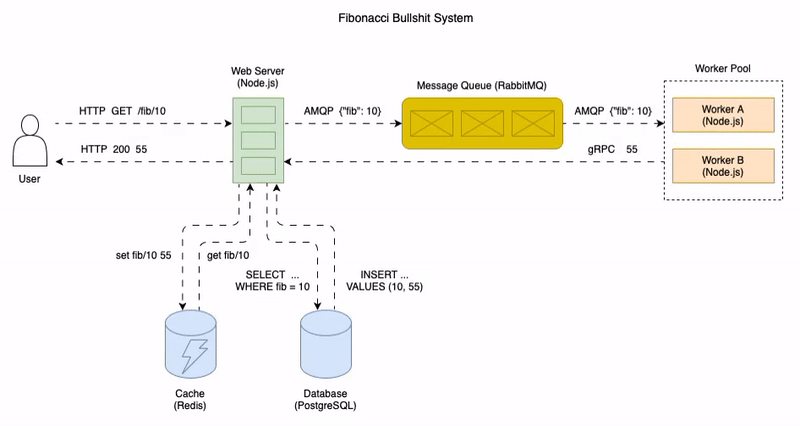

# Observability Sample

This project serves as a comprehensive example of how observability can be effectively integrated into Node.js applications. It leverages several powerful open-source technologies to generate, collect, and visualize telemetry data, enhancing the monitoring capabilities of your applications.

## Key Technologies
- **[Open Telemetry](https://opentelemetry.io/docs/)**: A framework for generating, collecting, and exporting telemetry data, enabling observability across your services.
- **[Prometheus](https://prometheus.io/docs/introduction/overview/)**: A robust system for storing and managing metrics, providing insights into application performance.
- **[Tempo](https://grafana.com/docs/tempo/latest/)**: A tool for storing and managing traces, helping to understand the flow of requests through your system.
- **[Loki](https://grafana.com/docs/loki/latest/)**: A log aggregation system designed to store and manage logs efficiently.
- **[Grafana](https://grafana.com/docs/grafana/latest/)**: A powerful visualization dashboard that integrates with various data sources (metrics, traces, and logs) to present observability data in a user-friendly manner.

## Architecture

The architecture of this project consists of multiple components that communicate with each other using various protocols, including HTTP, AMQP, and gRPC. This design aims to showcase how Open Telemetry integrates with different tools and to highlight the advantages of effective monitoring and observability in modern applications.

The following diagram gives an overview of the overall system and the communication between its components.

